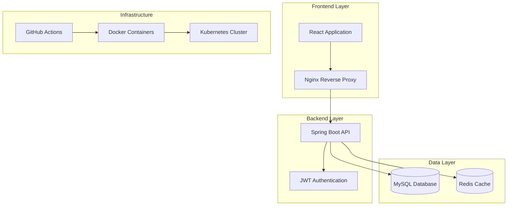

# Design Document

## Overview

Snipper is architected as a modern, cloud-native application following microservices principles with a clear separation between frontend and backend. The system uses a RESTful API architecture with JWT-based authentication, containerized deployment, and automated CI/CD pipelines. The design emphasizes scalability, maintainability, and production readiness.

## Architecture

### High-Level Architecture



### Technology Stack

**Backend:**
- Spring Boot 3.x with Java 17
- Spring Security with JWT authentication
- Spring Data JPA with Hibernate
- MySQL 8.0 for primary data storage
- Redis for session caching (optional)
- Maven for dependency management

**Frontend:**
- React 18+ with functional components and hooks
- React Router for navigation
- Context API for state management
- Axios for HTTP client
- Prism.js for syntax highlighting
- React-Markdown for Markdown rendering
- CSS Modules for styling

**Infrastructure:**
- Docker and Docker Compose for containerization
- Kubernetes for orchestration
- GitHub Actions for CI/CD
- Nginx for reverse proxy and static file serving

## Components and Interfaces

### Backend Components

#### 1. Authentication Service
```java
@RestController
@RequestMapping("/api/auth")
public class AuthController {
    @PostMapping("/register")
    public ResponseEntity<AuthResponse> register(@RequestBody RegisterRequest request);
    
    @PostMapping("/login")
    public ResponseEntity<AuthResponse> login(@RequestBody LoginRequest request);
    
    @PostMapping("/refresh")
    public ResponseEntity<AuthResponse> refreshToken(@RequestBody RefreshTokenRequest request);
}
```

#### 2. Snippet Service
```java
@RestController
@RequestMapping("/api/snippets")
public class SnippetController {
    @GetMapping
    public ResponseEntity<PagedResponse<SnippetSummary>> getSnippets(@RequestParam Map<String, String> params);
    
    @GetMapping("/{id}")
    public ResponseEntity<SnippetDetail> getSnippet(@PathVariable Long id);
    
    @PostMapping
    public ResponseEntity<SnippetDetail> createSnippet(@RequestBody CreateSnippetRequest request);
    
    @PutMapping("/{id}")
    public ResponseEntity<SnippetDetail> updateSnippet(@PathVariable Long id, @RequestBody UpdateSnippetRequest request);
    
    @DeleteMapping("/{id}")
    public ResponseEntity<Void> deleteSnippet(@PathVariable Long id);
}
```

#### 3. User Service
```java
@RestController
@RequestMapping("/api/users")
public class UserController {
    @GetMapping("/profile")
    public ResponseEntity<UserProfile> getCurrentUser();
    
    @PutMapping("/profile")
    public ResponseEntity<UserProfile> updateProfile(@RequestBody UpdateProfileRequest request);
    
    @GetMapping("/{username}/snippets")
    public ResponseEntity<PagedResponse<SnippetSummary>> getUserSnippets(@PathVariable String username);
}
```

### Frontend Components

#### 1. Authentication Components
- `LoginForm`: User login interface
- `RegisterForm`: User registration interface
- `AuthProvider`: Context provider for authentication state
- `ProtectedRoute`: Route wrapper for authenticated pages

#### 2. Snippet Components
- `SnippetEditor`: Markdown editor with live preview
- `SnippetViewer`: Display component with syntax highlighting
- `SnippetList`: List component with pagination
- `SnippetCard`: Summary card component

#### 3. Layout Components
- `Header`: Navigation and user menu
- `Sidebar`: Navigation menu
- `Layout`: Main application layout wrapper

#### 4. Page Components
- `HomePage`: Landing page
- `Dashboard`: User's snippet management
- `ExplorePage`: Public snippet discovery
- `SnippetDetailPage`: Individual snippet view
- `CreateSnippetPage`: New snippet creation

## Data Models

### User Entity
```java
@Entity
@Table(name = "users")
public class User {
    @Id
    @GeneratedValue(strategy = GenerationType.IDENTITY)
    private Long id;
    
    @Column(unique = true, nullable = false)
    private String username;
    
    @Column(unique = true, nullable = false)
    private String email;
    
    @Column(nullable = false)
    private String passwordHash;
    
    @CreationTimestamp
    private LocalDateTime createdAt;
    
    @UpdateTimestamp
    private LocalDateTime updatedAt;
    
    @OneToMany(mappedBy = "author", cascade = CascadeType.ALL)
    private List<Snippet> snippets;
}
```

### Snippet Entity
```java
@Entity
@Table(name = "snippets")
public class Snippet {
    @Id
    @GeneratedValue(strategy = GenerationType.IDENTITY)
    private Long id;
    
    @Column(nullable = false)
    private String title;
    
    @Column(columnDefinition = "TEXT")
    private String description;
    
    @Column(columnDefinition = "LONGTEXT", nullable = false)
    private String content;
    
    @Column(nullable = false)
    private String language;
    
    @Enumerated(EnumType.STRING)
    private VisibilityType visibility;
    
    @ElementCollection
    @CollectionTable(name = "snippet_tags")
    private Set<String> tags;
    
    @ManyToOne(fetch = FetchType.LAZY)
    @JoinColumn(name = "author_id", nullable = false)
    private User author;
    
    @CreationTimestamp
    private LocalDateTime createdAt;
    
    @UpdateTimestamp
    private LocalDateTime updatedAt;
}
```

### Database Schema
```sql
-- Users table
CREATE TABLE users (
    id BIGINT AUTO_INCREMENT PRIMARY KEY,
    username VARCHAR(50) UNIQUE NOT NULL,
    email VARCHAR(100) UNIQUE NOT NULL,
    password_hash VARCHAR(255) NOT NULL,
    created_at TIMESTAMP DEFAULT CURRENT_TIMESTAMP,
    updated_at TIMESTAMP DEFAULT CURRENT_TIMESTAMP ON UPDATE CURRENT_TIMESTAMP,
    INDEX idx_username (username),
    INDEX idx_email (email)
);

-- Snippets table
CREATE TABLE snippets (
    id BIGINT AUTO_INCREMENT PRIMARY KEY,
    title VARCHAR(255) NOT NULL,
    description TEXT,
    content LONGTEXT NOT NULL,
    language VARCHAR(50) NOT NULL,
    visibility ENUM('PUBLIC', 'PRIVATE') DEFAULT 'PUBLIC',
    author_id BIGINT NOT NULL,
    created_at TIMESTAMP DEFAULT CURRENT_TIMESTAMP,
    updated_at TIMESTAMP DEFAULT CURRENT_TIMESTAMP ON UPDATE CURRENT_TIMESTAMP,
    FOREIGN KEY (author_id) REFERENCES users(id) ON DELETE CASCADE,
    INDEX idx_author_id (author_id),
    INDEX idx_visibility (visibility),
    INDEX idx_language (language),
    INDEX idx_created_at (created_at),
    FULLTEXT INDEX idx_search (title, description)
);

-- Snippet tags table
CREATE TABLE snippet_tags (
    snippet_id BIGINT NOT NULL,
    tags VARCHAR(50) NOT NULL,
    FOREIGN KEY (snippet_id) REFERENCES snippets(id) ON DELETE CASCADE,
    INDEX idx_snippet_id (snippet_id),
    INDEX idx_tags (tags)
);
```

## Error Handling

### Backend Error Handling
```java
@ControllerAdvice
public class GlobalExceptionHandler {
    @ExceptionHandler(ValidationException.class)
    public ResponseEntity<ErrorResponse> handleValidation(ValidationException ex) {
        return ResponseEntity.badRequest()
            .body(new ErrorResponse("VALIDATION_ERROR", ex.getMessage()));
    }
    
    @ExceptionHandler(ResourceNotFoundException.class)
    public ResponseEntity<ErrorResponse> handleNotFound(ResourceNotFoundException ex) {
        return ResponseEntity.notFound()
            .body(new ErrorResponse("RESOURCE_NOT_FOUND", ex.getMessage()));
    }
    
    @ExceptionHandler(UnauthorizedException.class)
    public ResponseEntity<ErrorResponse> handleUnauthorized(UnauthorizedException ex) {
        return ResponseEntity.status(HttpStatus.UNAUTHORIZED)
            .body(new ErrorResponse("UNAUTHORIZED", ex.getMessage()));
    }
}
```

### Frontend Error Handling
- Global error boundary for React components
- HTTP interceptors for API error handling
- User-friendly error messages and fallback UI
- Retry mechanisms for transient failures

## Testing Strategy

### Backend Testing
1. **Unit Tests**
   - Service layer tests with mocked dependencies
   - Repository tests with @DataJpaTest
   - Controller tests with @WebMvcTest
   - Target: 80%+ code coverage

2. **Integration Tests**
   - Full API endpoint testing with @SpringBootTest
   - Database integration tests with TestContainers
   - Security integration tests

3. **Contract Tests**
   - API contract validation with Spring Cloud Contract
   - Schema validation for request/response models

### Frontend Testing
1. **Unit Tests**
   - Component tests with React Testing Library
   - Hook tests with @testing-library/react-hooks
   - Utility function tests with Jest

2. **Integration Tests**
   - API integration tests with MSW (Mock Service Worker)
   - User flow tests with Testing Library

3. **End-to-End Tests**
   - Critical user journeys with Playwright or Cypress
   - Cross-browser compatibility testing

### Performance Testing
- Load testing with JMeter or k6
- Database query optimization
- Frontend bundle size optimization
- API response time monitoring

## Security Considerations

### Authentication & Authorization
- JWT tokens with short expiration times
- Refresh token rotation
- Role-based access control (RBAC)
- Password hashing with BCrypt

### API Security
- CORS configuration for cross-origin requests
- Rate limiting to prevent abuse
- Input validation and sanitization
- SQL injection prevention with parameterized queries

### Infrastructure Security
- Container security scanning
- Kubernetes security policies
- Secrets management with Kubernetes secrets
- Network policies for pod-to-pod communication

## Deployment Architecture

### Local Development
```yaml
# docker-compose.yml structure
version: '3.8'
services:
  mysql:
    image: mysql:8.0
    environment:
      MYSQL_DATABASE: snipper
      MYSQL_ROOT_PASSWORD: rootpassword
    volumes:
      - mysql_data:/var/lib/mysql
    ports:
      - "3306:3306"

  backend:
    build: ./backend
    environment:
      SPRING_PROFILES_ACTIVE: dev
      DB_HOST: mysql
    depends_on:
      - mysql
    ports:
      - "8080:8080"

  frontend:
    build: ./frontend
    environment:
      REACT_APP_API_URL: http://localhost:8080
    ports:
      - "3000:3000"
```

### Kubernetes Production
- Namespace isolation for different environments
- ConfigMaps for application configuration
- Secrets for sensitive data
- Persistent volumes for database storage
- Horizontal Pod Autoscaler for scaling
- Ingress controller for external access
- Health checks and readiness probes

### CI/CD Pipeline
1. **Build Stage**
   - Code checkout and dependency installation
   - Unit test execution
   - Code quality analysis with SonarQube

2. **Test Stage**
   - Integration test execution
   - Security scanning
   - Performance testing

3. **Deploy Stage**
   - Docker image building and pushing
   - Kubernetes manifest deployment
   - Smoke tests and health checks